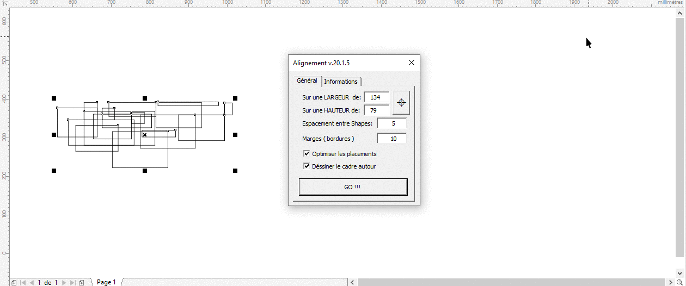

# Выравнивание объектов

Укладчик объектов на листе от фразнцузских и бразильских товарищей. Укладывает не просто рядами, а ещё и добавляет на пустое место по уложенным колонкам (если прожать галочку "Оптимизировать по столбцам").

Описание

- По имени файла известен как `promacro01_Alignemento_RU.gms`.
- Автор - **Fabrice VAN NEER** (http://kafard62.free.fr), версия на русском - **elvin-nsk**.
- Проверенно работает в версии **16**.
- Языки: **русский**, в архиве - **португальский**, исходный - **французский**
- Распространяется **бесплатно**, код **открытый**.
- **Поддерживается сообществом**.
- Аналоги: [DirectEnpack](https://github.com/fersatgit/DirectEnpack) (с укладкой под плоттерную резку), [QuickComposer](https://github.com/elvin-nsk/QuickComposer) (укладка рядами), [Tiler](https://github.com/elvin-nsk/cdr-vba/tree/master/catalog/Tiler) (укладка с проставлением меток).

## Скачать

- Русифицированная версия - в корне.
- Versia sobre Portuguesa em `archive` - [link](archive/ProMACRO_01.gms).

- Иконка:

  

## Установка

[Стандартная](https://github.com/elvin-nsk/cdr-vba/blob/master/articles/installation.md).

## Использование

